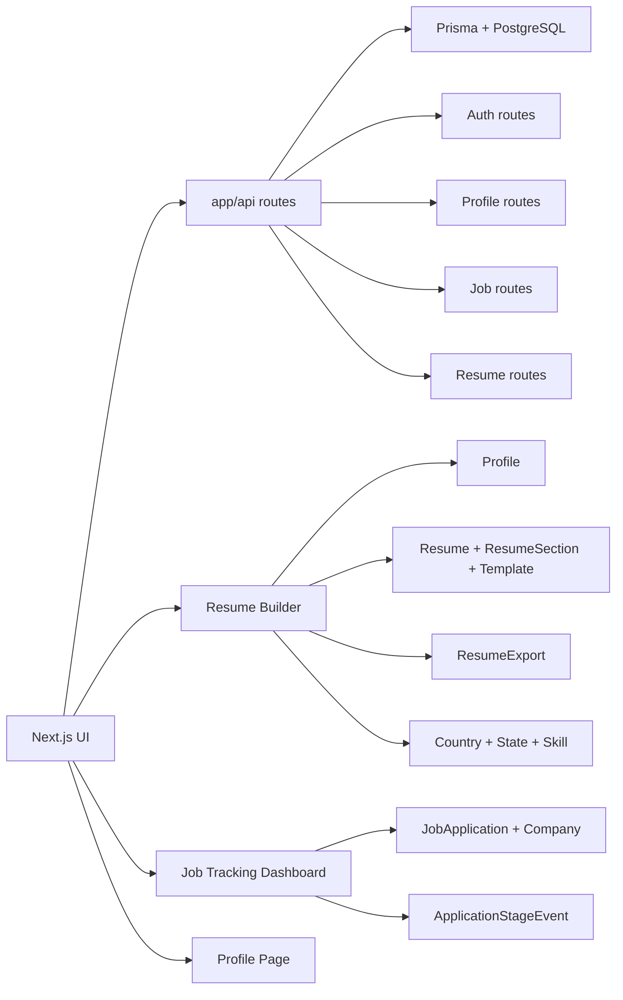

# Data Flow Diagram

```mermaid
flowchart LR
  UI[Next.js UI] --> API[app/api routes]
  API --> DB[Prisma + PostgreSQL]

  UI --> ResumeBuilder[Resume Builder]
  UI --> Dashboard[Job Tracking Dashboard]
  UI --> Profile[Profile Page]

  ResumeBuilder --> ProfileData[Profile]
  ResumeBuilder --> ResumeData[Resume + ResumeSection + Template]
  ResumeBuilder --> ExportData[ResumeExport]
  ResumeBuilder --> LookupData[Country + State + Skill]

  Dashboard --> JobData[JobApplication + Company]
  Dashboard --> StageHistory[ApplicationStageEvent]

  API --> Auth[Auth routes]
  API --> ProfileAPI[Profile routes]
  API --> JobsAPI[Job routes]
  API --> ResumeAPI[Resume routes]
```
