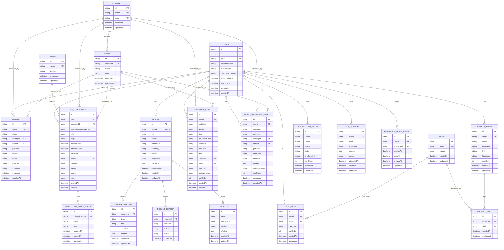

# Entity Relationship Diagram

```mermaid
erDiagram
  USER ||--o| PROFILE : has
  USER ||--o{ RESUME : owns
  USER ||--o{ JOB_APPLICATION : submits
  USER ||--o{ USER_SKILL : has
  USER ||--o{ EDUCATION_ENTRY : has
  USER ||--o{ WORK_EXPERIENCE_ENTRY : has
  USER ||--o{ PROJECT_ENTRY : has
  USER ||--o{ CERTIFICATION_ENTRY : has
  USER ||--o{ LOGIN_ATTEMPT : logs
  USER ||--o{ PASSWORD_RESET_TOKEN : resets

  RESUME ||--o{ RESUME_SECTION : contains
  RESUME ||--o{ RESUME_EXPORT : exports
  RESUME ||--o| TEMPLATE : uses

  JOB_APPLICATION ||--o{ APPLICATION_STAGE_EVENT : tracks
  COMPANY ||--o{ JOB_APPLICATION : linked_to
  COUNTRY ||--o{ STATE : contains
  COUNTRY ||--o{ PROFILE : referenced_by
  STATE ||--o{ PROFILE : referenced_by
  COUNTRY ||--o{ EDUCATION_ENTRY : referenced_by
  STATE ||--o{ EDUCATION_ENTRY : referenced_by
  COUNTRY ||--o{ WORK_EXPERIENCE_ENTRY : referenced_by
  STATE ||--o{ WORK_EXPERIENCE_ENTRY : referenced_by
  COUNTRY ||--o{ JOB_APPLICATION : referenced_by
  STATE ||--o{ JOB_APPLICATION : referenced_by
  SKILL ||--o{ USER_SKILL : referenced_by
  SKILL ||--o{ PROJECT_SKILL : referenced_by
  PROJECT_ENTRY ||--o{ PROJECT_SKILL : tags

  USER {
    string id PK
    string name
    string email UK
    string passwordHash
    string authProvider
    string providerAccountId
    datetime emailVerifiedAt
    datetime lastLoginAt
    datetime createdAt
    datetime updatedAt
  }

  PROFILE {
    string id PK
    string userId UK, FK
    string phone
    string countryId FK
    string stateId FK
    string pincode
    string linkedin
    string github
    string portfolio
    string summary
    datetime createdAt
    datetime updatedAt
  }

  TEMPLATE {
    string id PK
    string name
    string description
    string version
    bool isActive
    datetime createdAt
    datetime updatedAt
  }

  RESUME {
    string id PK
    string userId UK, FK
    string title
    string status
    string templateId FK
    string summary
    string jobTitle
    string targetRole
    float atsScore
    datetime generatedAt
    datetime createdAt
    datetime updatedAt
  }

  RESUME_SECTION {
    string id PK
    string resumeId FK
    string type
    string title
    int sortOrder
    json content
    datetime createdAt
    datetime updatedAt
  }

  RESUME_EXPORT {
    string id PK
    string resumeId FK
    string fileName
    string filePath
    string format
    datetime createdAt
  }

  SKILL {
    string id PK
    string name UK
    string category
    datetime createdAt
    datetime updatedAt
  }

  USER_SKILL {
    string id PK
    string userId FK
    string skillId FK
    string category
    int sortOrder
    datetime createdAt
    datetime updatedAt
  }

  EDUCATION_ENTRY {
    string id PK
    string userId FK
    string institution
    string degree
    string field
    string educationLevel
    string startDate
    string endDate
    string gpa
    string countryId FK
    string stateId FK
    string pincode
    string achievements
    int sortOrder
    datetime createdAt
    datetime updatedAt
  }

  WORK_EXPERIENCE_ENTRY {
    string id PK
    string userId FK
    string company
    string position
    string countryId FK
    string stateId FK
    string pincode
    string startDate
    string endDate
    bool current
    string achievements
    int sortOrder
    datetime createdAt
    datetime updatedAt
  }

  PROJECT_ENTRY {
    string id PK
    string userId FK
    string name
    string description
    string link
    string highlights
    int sortOrder
    datetime createdAt
    datetime updatedAt
  }

  PROJECT_SKILL {
    string id PK
    string projectId FK
    string skillId FK
    datetime createdAt
    datetime updatedAt
  }

  CERTIFICATION_ENTRY {
    string id PK
    string userId FK
    string name
    string issuer
    string date
    string credentialId
    int sortOrder
    datetime createdAt
    datetime updatedAt
  }

  COMPANY {
    string id PK
    string name UK
    string website
    datetime createdAt
    datetime updatedAt
  }

  JOB_APPLICATION {
    string id PK
    string userId FK
    string companyId FK
    string manualCompanyName
    string role
    string stage
    datetime appliedDate
    datetime interviewDate
    string countryId FK
    string stateId FK
    string pincode
    string salary
    string source
    string notes
    datetime createdAt
    datetime updatedAt
  }

  APPLICATION_STAGE_EVENT {
    string id PK
    string jobApplicationId FK
    string stage
    string note
    datetime occurredAt
    datetime createdAt
    datetime updatedAt
  }

  COUNTRY {
    string id PK
    string name UK
    string code UK
    datetime createdAt
    datetime updatedAt
  }

  STATE {
    string id PK
    string countryId FK
    string name
    string code
    datetime createdAt
    datetime updatedAt
  }

  LOGIN_ATTEMPT {
    string id PK
    string userId FK
    string email
    string ipAddress
    bool success
    string reason
    datetime attemptedAt
    datetime createdAt
    datetime updatedAt
  }

  PASSWORD_RESET_TOKEN {
    string id PK
    string userId FK
    string tokenHash UK
    datetime expiresAt
    datetime usedAt
    datetime createdAt
    datetime updatedAt
  }
```
